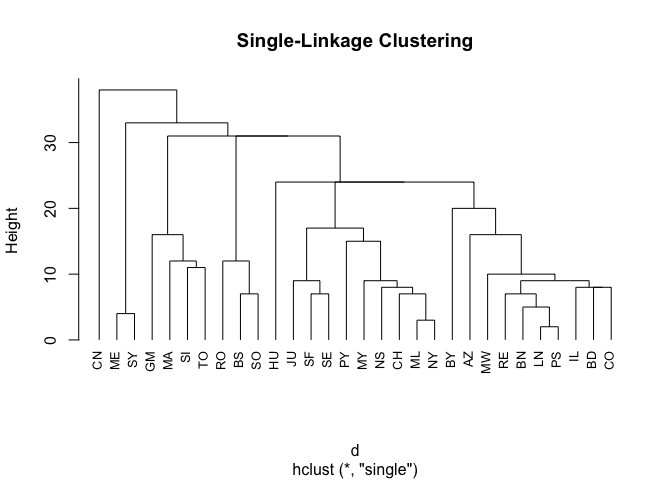

Cluster Analysis: Notes and Exercises
================
Brian Lance
August 16, 2016

``` r
library(cluster.datasets)
# prep data
data("airline.distances.1966")
d <- airline.distances.1966
d <- d[,-1] # remove column containing city codes
d <- as.dist(d) # convert to distance matrix
# run single linkage cluster algorithm
fit.single <- hclust(d, method = "single")
plot(fit.single, hang=-1, cex=0.8, main="Single-Linkage Clustering")
```


