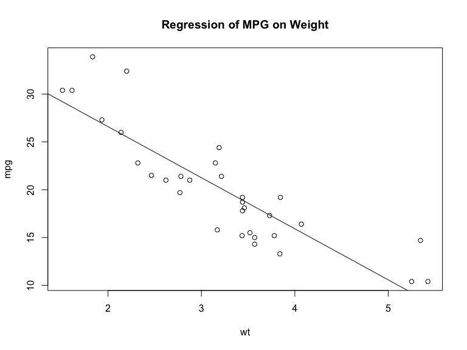
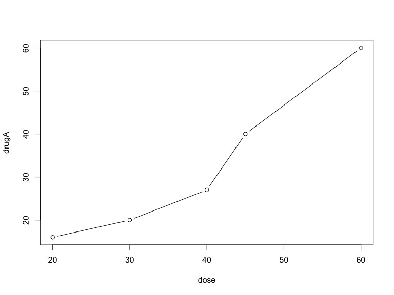
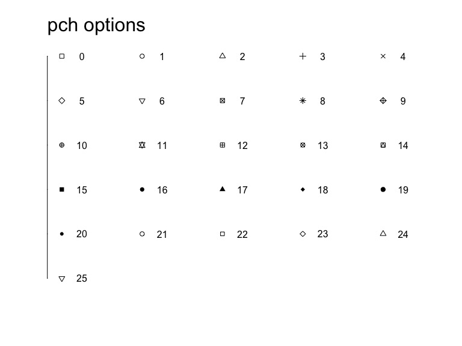
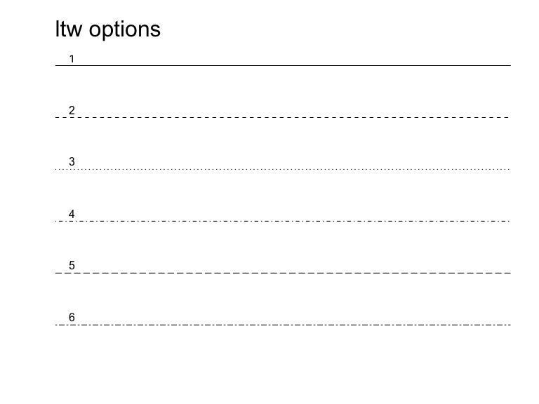
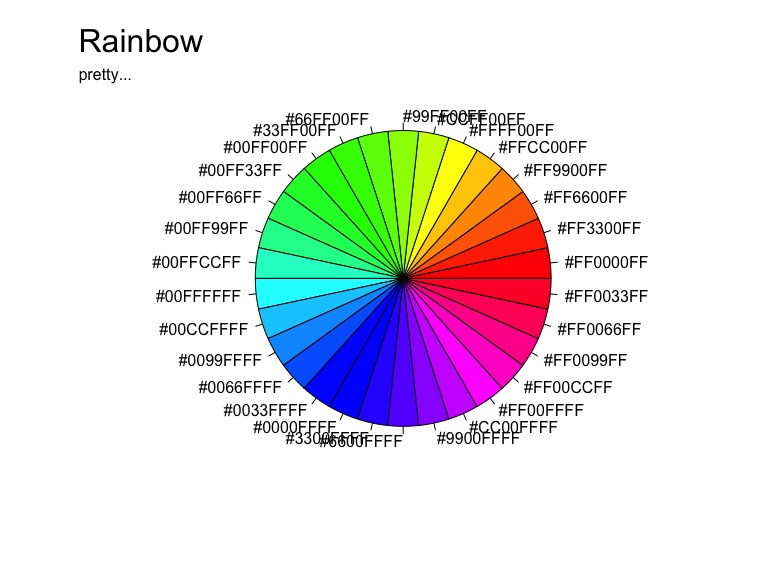
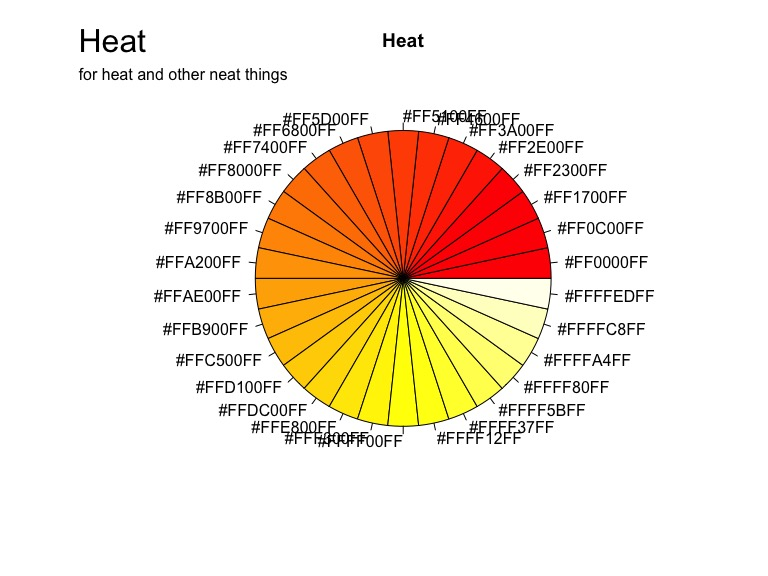
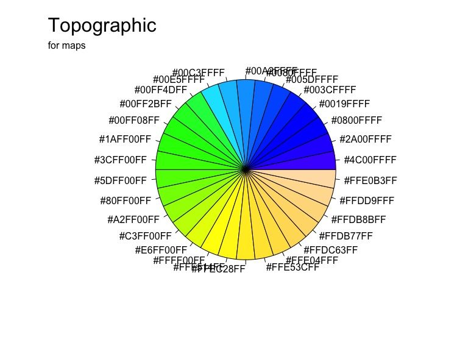
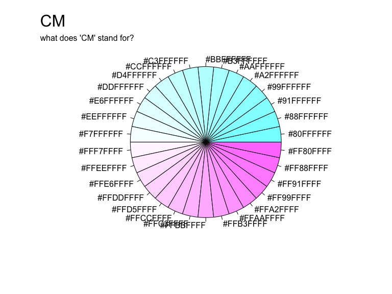
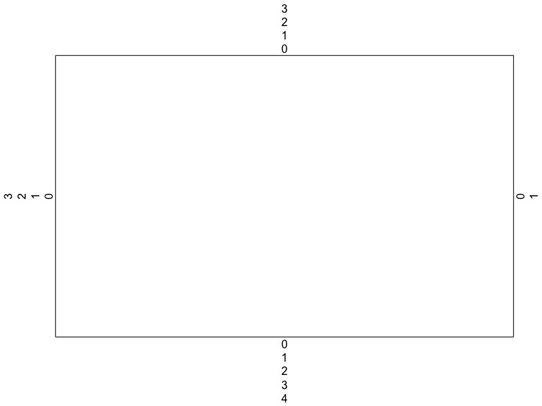

Chapter 3:Graph Intro
================

-   [Overview](#overview)
-   [Working with graphs](#working-with-graphs)
-   [Simple example](#simple-example)
-   [Graphical parameters](#graphical-parameters)
    -   [Point and line aesthetics](#point-and-line-aesthetics)
    -   [Colors](#colors)
    -   [Text](#text)
    -   [Graph and margin dimensions](#graph-and-margin-dimensions)
-   [- - - - - - STOPPED HERE 8/19/16 - - - - - - -](#stopped-here-81916--------------)
-   [Adding text, customized axes, and legends](#adding-text-customized-axes-and-legends)
    -   [Titles](#titles)
    -   [Axes](#axes)
    -   [Reference lines](#reference-lines)
    -   [Legend](#legend)
    -   [Text annotations](#text-annotations)
    -   [Math annotations](#math-annotations)
-   [Combining graphs](#combining-graphs)
    -   [Creating a figure arrangement with fine control](#creating-a-figure-arrangement-with-fine-control)
-   [Recap](#recap)

Overview
========

Working with graphs
===================

Graphs are built one statement at a time

``` r
attach(mtcars)
plot(wt, mpg)
abline(lm(mpg~wt))
title("Regression of MPG on Weight")
```



``` r
detach(mtcars)
```

Graphs are saved to disk by wrapping the graph-producing code in a `<file>() ... dev.off()` statement.

Possible filetypes include:

-   `win.metafile()`
-   `pdf()`
-   `png()`
-   `jpeg()`
-   `bmp()`
-   `tiff()`
-   `xfig()`
-   `postscript()`

Example code to produce a PDF (not run)

``` r
pdf("mygraph.pdf")
  attach(mtcars)
  plot(wt, mpg)
  abline(lm(mpg~wt))
  title("Regression of MPG on Weight")
  detach(mtcars)
dev.off()
```

Simple example
==============

``` r
dose <- c(20,30,40,45,60)
drugA <- c(16,20,27,40,60)
drugB <- c(15,18,25,31,40)
plot(dose, drugA, type="b")
```



Graphical parameters
====================

...are commonly called through `par(optionname=value, optionname=value, ...)`

-   `pch` specifies the symbol to use for points
-   `cex` specifies symbol size as a scale of 1, ex. `5 = scale by 500%`
-   `lty` specifies line type
-   `lwd` specifies line width as a scale of 1

Point and line aesthetics
-------------------------

All possible point symbols.

``` r
x <- rep(1:5,6)[1:26]
y <- c(rep(6:2,each=5),1)
pch_vals <- 0:25
plot(x-0.25, y,
     pch=pch_vals,
     xlim=c(min(x)-0.25, max(x)+0.25),
     bty = "n",
     axes = F, xlab=NA, ylab=NA)
mtext("pch options",side=3,cex=2,line=1.2,adj=0)
axis(side=2,labels=F,tck=F)
text(x,y,pch_vals)
```



All possible line types.

``` r
y <- c(1:6)
plot(y,
     lty=y,
     bty="n",
     axes=F, xlab=NA, ylab=NA,
     pch=NA)
mtext("ltw options",side=3,cex=2,line=1.2,adj=0)
text(x=1,y+0.15,rev(y))
abline(h=y,lty=rev(y))
```



Colors
------

Colors are specified by index `col=1`, name `col="white"`, hex code `col=#FFFFFF`, RGB `col=rdb(1,1,1)`, or HSV `col=hsv(0,0,1)`.

Parameters for customizing various plot components:

-   `col` set default plotting color. If a vector is provided, the plot will cycle through the vector while producing elements
-   `col.axis` sets axis text
-   `col.lab` sets axis labels
-   `col.main` sets title
-   `col.sub` sets subtitle
-   `fg` sets plot foreground
-   `bg` sets plot background

`colors()` returns all available color names.

``` r
head(colors())
```

    ## [1] "white"         "aliceblue"     "antiquewhite"  "antiquewhite1"
    ## [5] "antiquewhite2" "antiquewhite3"

R also has several functions for contiguous colors, including `rainbow()`, `heat.colors()`, `topo.colors()`, and `cm.colors()`.

``` r
n <- 30
colors <- rainbow(n)
pie(rep(1, n), labels=colors, col=colors)
mtext("Rainbow", side=3, cex=2, line=1.2, adj=0)
mtext("pretty...",side=3,cex=1,line=-0.25,adj=0)
```



``` r
colors <- heat.colors(n)
pie(rep(1, n), labels=colors, col=colors, main = "Heat")
mtext("Heat",side=3,cex=2,line=1.2,adj=0)
mtext("for heat and other neat things",side=3,cex=1,line=-0.25,adj=0)
```



``` r
colors <- topo.colors(n)
pie(rep(1, n), labels=colors, col=colors)
mtext("Topographic",side=3,cex=2,line=1.2,adj=0)
mtext("for maps",side=3,cex=1,line=-0.25,adj=0)
```



``` r
colors <- cm.colors(n)
pie(rep(1, n), labels=colors, col=colors)
mtext("CM",side=3,cex=2,line=1.2,adj=0)
mtext("what does 'CM' stand for?",side=3,cex=1,line=-0.25,adj=0)
```



Text
----

Text size:

-   `cex` size relative to 1
-   `cex.axis`
-   `cex.lab`
-   `cex.main`
-   `cex.sub`

Font family, point size, style:

-   `font` font for plotted text
-   `font.axis` axis text
-   `font.lab` axis labels
-   `font.main` titles
-   `font.sub` subtitles
-   `ps` font point size text size `=ps*cex`
-   `family` font family, standard values are `serif`, `sans`, and `mono`

Graph and margin dimensions
---------------------------

Dimension and margin size parameters:

-   `pin` plot dimensions (width, height) in inches (inches? strange...)
-   `mai` margin size, `c(bottom, left, top, right)` in inches
-   `mar` margin size, `c(bottom, left, top, right)` expressed in lines

Margin example. Source: <https://www.r-bloggers.com/setting-graph-margins-in-r-using-the-par-function-and-lots-of-cow-milk/>

``` r
plot(1:10,ann=FALSE,type="n",xaxt="n",yaxt="n")
for(j in 1:4) for(i in 0:10) mtext(as.character(i),side=j,line=i)
```



- - - - - - STOPPED HERE 8/19/16 - - - - - - -
==============================================

Adding text, customized axes, and legends
=========================================

Titles
------

Axes
----

Reference lines
---------------

Legend
------

Text annotations
----------------

Math annotations
----------------

Combining graphs
================

Creating a figure arrangement with fine control
-----------------------------------------------

Recap
=====
