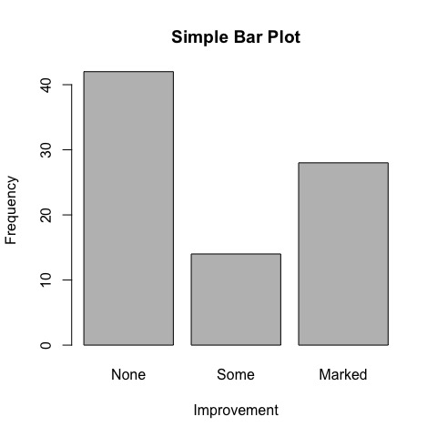
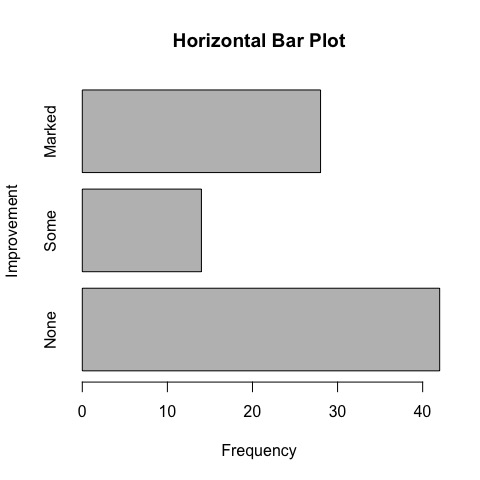

Chapter 6: Basic Graphs
================

-   [Intro](#intro)
-   [Bar plots](#bar-plots)
    -   [Simple bar plots](#simple-bar-plots)

Intro
=====

Bar plots
=========

Simple bar plots
----------------

The basic barplot. Lovely.

``` r
library(vcd)
counts <- table(Arthritis$Improved)
barplot(counts,
        main="Simple Bar Plot",
        xlab="Improvement", ylab="Frequency")
```



Let's flip it horizontally.

``` r
barplot(counts,
        horiz=TRUE,
        main="Horizontal Bar Plot",
        xlab="Frequency", ylab="Improvement")
```


